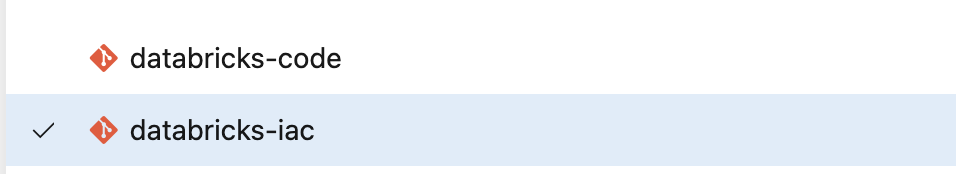
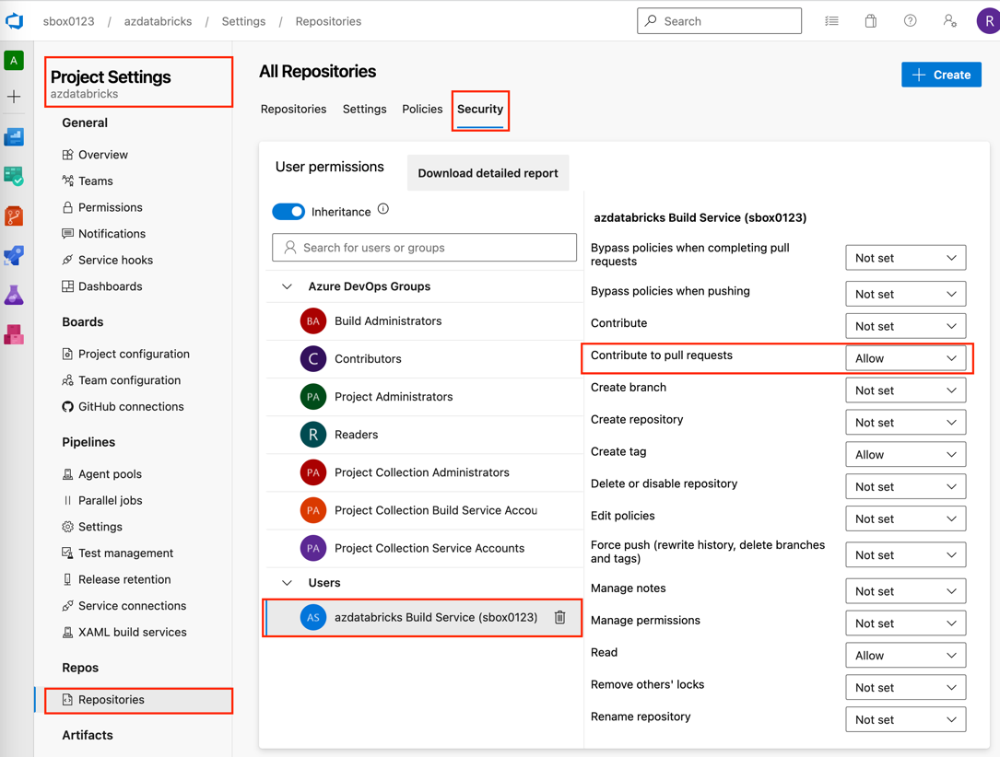
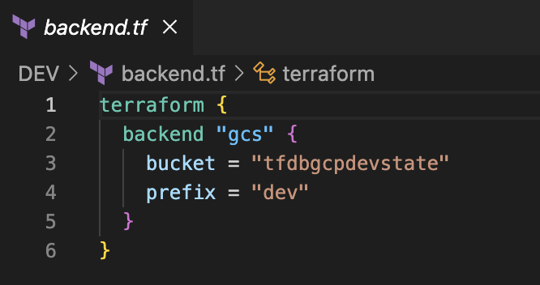
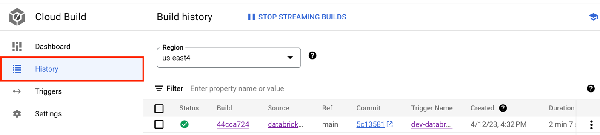
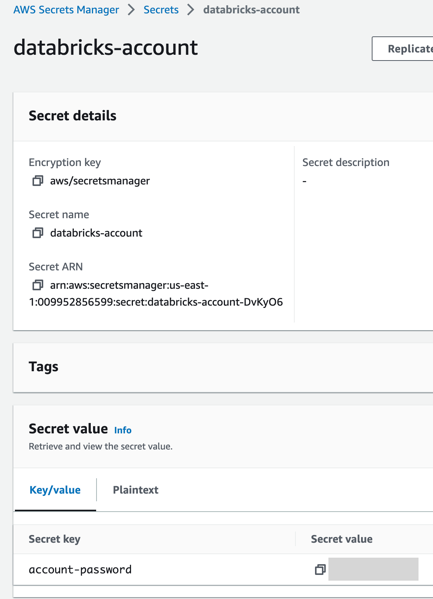

# About the Multi-cloud Databricks Accelerator:

The Multi-cloud Databricks accelerator is created to quickly setup
Databricks using Infrastructure as Code. It has been designed keeping in
mind the industry best practices on security and scalability while also
considering the ease of use of the solution.

# Set up Databricks on Azure using Multi-cloud Databricks Accelerator

The following image represents the use of Multi-cloud Databricks
accelerator in an automated execution mode.


1.  *Azure DevOps Repository for terraform code*

2.  *Azure DevOps Repository for Databricks notebook and other assets*

3.  *Azure DevOps Pipeline to create the Databricks Workspace*

4.  *Azure Storage account for terraform state file*

5.  *Azure Key Vault for secret/token keys*

6.  *Azure Active Directory (Azure AD) provides single sign-on (SSO) for
    Azure Databricks users.*

## Pre-requisites:

1)  An Azure user account with contributor access (or more restrictive
    permissions based on your project security/governance standards). At
    a minimum the user account should have the following permissions

    a.  Create and Manage Databricks Workspace (workspace, cluster,
        jobs, users etc.)

    b.  Create and Manage a Azure Storage Account

    c.  Create and Manage Azure Key Vault

2)  A service principal with either contributor access or more
    restrictive permissions based on your project security/governance
    standards). At a minimum the user account should have the following
    permissions

    a.  Create and Manage Databricks Workspace (workspace, cluster,
        jobs, users etc.)

    b.  Read and Write to an Azure Storage Account

    c.  Read Azure Key Vault

3)  Access to the Multi-cloud Databricks Accelerator

4)  Azure CLI installed on the local system (optional in case if the
    Accelerator is executed through Azure DevOps pipeline)

5)  An Azure DevOps account with access to an existing project with
    privilege to create new repository.

6)  Git, Azure Cli, terraform installed on the local computer (in case
    of local execution mode)

7)  Access to git repo
    <https://github.com/Deloitte-CA-CE/MLOps-Multi-cloud-Databricks>

## Step to Setup Databricks

1.  Create an Azure Storage account and a container within the storage
    account to store the remote state file. The screenshot below, shows
    a **rfdbaziac** for Storage account and **rfdbazdevstate** for a
    container. You can use any name for these resources -- these values
    are used while updating the **backend.tf** file.

NOTE: When using automation-execution mode, it is required that the
service principal have read/write access to the storage
account/container


2.  Create a Key Vault and add a secret to save the git token. The
    screenshot below, shows **tfdbaziac** for Key vault and **adtoken**
    for the secret. You can use any name for these resources -- these
    values are used while updating the **input.yaml** file.

NOTE: When using automation-execution mode, it is required that the
service principal have read access to the Key vault to read the secrets.

  ---------------------------------------------------------------------------------------------------------------------------------------------
  Screenshot displaying Key vault and secrets                            In the below image the service principal **celab-sbx-sp** has been
                                                                         provided access to key vault **tfdbaziac**
  ---------------------------------------------------------------------- ----------------------------------------------------------------------
 
   
  ---------------------------------------------------------------------------------------------------------------------------------------------

3.  Create two Azure DevOps repositories one for holding databricks code
    and another for holding the IaC code from Multi-cloud Databricks
    Accelerator. The screenshot below, shows **databricks-code** and
    **databricks-iac**. You can use any name for these resources --
    these values are used while updating the **input.yaml** file.



4.  \[OPTIONAL\] upload an existing python file or a file named test.py
    file to **databricks-code** repository.

5.  Download Multi-cloud Databricks Accelerator from the git repository
    <https://github.com/Deloitte-CA-CE/MLOps-Multi-cloud-Databricks>
    using the git clone command or download as zip file from GitHub.

6.  Navigate to the **MLOps-Multi-cloud-Databricks** folder and
    duplicate the AZURE folder and rename it to the either of DEV or QA
    or PROD depending on the databricks environment you are setting up.
    If setting up multiple environments create multiple copies of the
    AZURE folder.


7.  Once the copy action is complete in step#6 navigate to one of the
    folders, here as example **DEV** folder contents are displayed.


8.  Open the **backend.tf** file in a code editor (e.g., Visual Studio
    Code) and update the values for **resource_group_name,
    storage_account_name, container_name** from step#1. The value for
    **key** can be any string of the format **\*.tfstate**


9.  Expanding the **Pipeline-files** folder reveals the prebuild
    pipeline configuration files, make a copy of the
    **azure_pipeline_template.yaml** under **Pipeline-files** \> **azure
    folder** to the root of the directory and rename it to indicate it
    is for development for example

**azure-dev-pipeline.yaml** as show below


10. As shown below, within Azure DevOps **Pipelines** \> **Library**
    create a **Variable group** for dev environment and populate the
    values for **access_key**, **client_id**, **client_secret** from the
    service principal, and the **subscription_id** and **tenant_id**
    values from azure subscription. The below table lists the mapping of
    the earlier mentioned value to the variables in the variable group.

NOTE: If multiple service principals are being used one for each
environment, multiple variable groups must be created.

  -----------------------------------------------------------------------
  **access_key**                  **ARM_ACCESS_KEY**
  ------------------------------- ---------------------------------------
  **client_id**                   **ARM_CLIENT_ID**

  **client_secret**               **ARM_CLIENT_SECRET**

  **subscription_id**             **ARM_SUBSCRIPTION_ID**

  **tenant_id**                   **ARM_TENANT_ID**
  -----------------------------------------------------------------------


 

11. Create an Environment under Azure DevOps **Pipelines** \>
    **Environments** \> **New Environment**. The environment can be used
    to add approval gates to the terraform apply steps.


12. Back with in the local **MLOps-Multi-cloud-Databricks** folder, edit
    the **azure-dev-pipeline.yaml** file based on the information
    provided below.


+------------------+---------------------------------------------------+
| Parameter Name   | Description                                       |
+==================+===================================================+
| trigger          | The push triggers for the pipeline, refer to the  |
|                  | below url for more information.                   |
|                  |                                                   |
|                  | Ref:                                              |
|                  | https://learn.microsoft.com/en-us/azure/devops/p  |
|                  | ipelines/yaml-schema/trigger?view=azure-pipelines |
+------------------+---------------------------------------------------+
| template         | The path to the template yaml file                |
+------------------+---------------------------------------------------+
| variable_group   | The name of the variable group relevant to the    |
|                  | pipeline yaml file, in this case it's the dev     |
|                  | variable group created above in **step#10**       |
+------------------+---------------------------------------------------+
| Agent Pool       | Update this value based on the Agent Pools        |
|                  | available to your Azure DevOps project            |
+------------------+---------------------------------------------------+
| ado_org          | The name of the Azure DevOps Org in which the     |
|                  | project resides                                   |
+------------------+---------------------------------------------------+
| ado_project      | The name of the Azure DevOps project              |
+------------------+---------------------------------------------------+
| environment      | The name of the environment created on            |
|                  | **step#11**                                       |
+------------------+---------------------------------------------------+
| list_            | The path of the folder containing the terraform   |
| sub_folders.name | code -- in this case it's the DEV folder          |
+------------------+---------------------------------------------------+


13. Under **DEV** folder open and edit the **input.yaml** file based on
    the details provided below

{width="1.8081594488188977in"
height="2.519425853018373in"}
{width="3.507849956255468in"
height="2.423963254593176in"}

  -----------------------------------------------------------------------------
  Parameter Name            Description
  ------------------------- ---------------------------------------------------
  prefix                    A free form text string that would be used while
                            creating resources

  azure_region              An Azure region in which the resource group for the
                            databricks account would be created

  tag_environment           A tag value for environment, enter a text string

  workspace_dir_path        A folder name that would be created in the
                            Databricks workspace

  git_username              A git username for the databricks code repository
                            which would be mapped as a remote repo

  git_provider              The name of the git provider for the remote repo,
                            for Azure DevOps repository use azureDevOpsServices

  resource_group            Name of the resource group for the Azure Key vault

  key_vault_name            Name of the key vault

  secret_key_name           Name of the secret key which holds the token for
                            Azure DevOps repository

  path_in_workspace         The folder path in the Databricks workspace to with
                            the remote repository is mapped.

  branch                    The name of the branch in the remote repo to be
                            mapped to the workspace folder path

  git_url                   The url for the remote git repo

  node_type_id              The note type id for the cluster nodes

  databricks_job_name       The name used for the databricks job

  databricks_job_cron       The cron string for databricks job

  databricks_tz_id          The time zone for the databricks job

  email_notify_on_success   A list of email ids to receive job success
                            notification

  email_notify_on_start     A list of email ids to receive job start
                            notification

  email_notify_on_failure   A list of email ids to receive job failure
                            notification

  job_task_name             The name used for job task

  job_notebook_task_path    The path of notebook file in the remote repository
                            relative to root

  users                     The list of users to be provisioned

  email                     The email id of the user

  workspace_access          Flag to provide access to Databricks workspace
  -----------------------------------------------------------------------------

14. Once all the above updates are complete, check in the contents of
    the **MLOps-Multi-cloud-Databricks** folder to **databricks-iac**
    repository created in **step#3.** Below is a view of the
    **databricks-iac** repository

{width="4.339679571303587in"
height="2.6402832458442695in"}

15. Create an Azure DevOps pipeline by following the below steps:

    a.  Navigate Azure DevOps Pipeline \> New pipeline

    b.  Next for Where is your code? Select **Azure Repos Git**

    c.  Next for Select a repository -- choose **databricks-iac**

    d.  For Configure your pipeline -- choose **Existing Azure Pipelines
        YAML file**

    e.  In the pop screen for **Select an existing YAML file** for
        branch select **main** and for **Path** select
        **/azure-dev-pipeline.yaml**

    f.  Click on Continue to create the pipeline

    g.  On the **Review your pipeline YAML** click on the drop down
        around next to **Run** and choose **Save**

    h.  On the next screen, rename the pipeline to
        **databricks-iac-dev** to indicate this pipeline is for
        development environment

{width="4.865217629046369in"
height="1.987150043744532in"}

16. Enable a build policy on master branch by following the below steps:

    a.  Navigate **Project settings** \> **Repositories** \> select
        **databricks-iac** \> select **Policies** \> Under Branch
        policies select **main \>** under **Build Validation \>** Click
        on **+** button to add a build policy

    b.  Next for the Build Pipeline select **databricks-iac-dev** and
        for path enter **/DEV** - this will ensure that this Pipeline
        runs on a Pull Request only when there are changes to the
        contents of **DEV** folder

17. Enable the pipeline to post back the terraform plan output to the
    repository pull request by following the below steps:

    a.  Navigate **Project Settings** \> **Repositories** \>
        **Security** \> **\<PROJECT_NAME\> Build Service
        (\<ORG_NAME\>)** \> set the **Contribute to pull requests** to
        **Allow**

> **\<PROJECT_NAME\> Build Service (\<ORG_NAME\>)** in the below
> screenshot it is **azdatabricks Build Service (sbox0123)**

{width="4.886956474190726in"
height="3.7022867454068242in"}

18. Next create a new branch (e.g. feature123) for the
    **databricks-iac** repository and check-in a change into the DEV
    folder of the new branch(feature123). Raise a pull request(PR) to
    main branch from feature123 branch and this should trigger a pull
    request pipeline run of the **azure-iac-dev** pipeline which posts
    the terraform plan output to the pull request screen as shown in the
    below screenshot. If the output as expected, the PR can be merged by
    clicking on **Approve** and **Complete** and this would trigger
    another pipeline run that executes the terraform approve step.

{width="3.6173917322834646in"
height="3.4314982502187226in"}

19. Additionally, if an approval gate is required after the **PR merge**
    and before **terraform apply run**, enable approval gate on the
    environment created in **step#11** by following the below steps:

    a.  Navigate Azure DevOps Pipelines \> Environments \> select the
        environment e.g. **az-databricks** \> select more actions
        (**three dots** button next to **Add resources** button \>
        select **Approvals and Checks** \> select **Approvals** \> add
        the **Approvers \>** click **Create**

{width="5.577823709536308in"
height="3.0368153980752406in"}

# Setup Databricks on Google Cloud using Multi-cloud Databricks Accelerator.

The following image represents the use of Multi-cloud Databricks
accelerator in an automated execution mode.

{width="5.148437226596675in"
height="3.5522014435695537in"}

1.  *GCP Cloud Source Repositories for terraform code.*

2.  *GitHub Repository for Databricks notebook and other assets*

3.  *Cloud Build Pipeline to create the Databricks Workspace*

4.  *GCP Cloud Storage for terraform state file.*

5.  *GCP Secret Manager for secret/token keys*

## Pre-requisites:

1)  A GCP user account with owner access to a project (or more
    restrictive permissions based on your project security/governance
    standards). At a minimum the user account should have the following
    permissions

    a.  Create and Manage Databricks Workspace (workspace, cluster,
        jobs, users etc.)

    b.  Create and Manage Google Cloud Storage

    c.  Create and Manage Google Secret Manager

    d.  Google Cloud Build

    e.  Google Cloud Source Repositories

2)  A service account with either owner access to a project or more
    restrictive permissions based on your project security/governance
    standards). At a minimum the service account should have the
    following permissions

    a.  Compute Network Admin

    b.  Databricks Workspace Creator

    c.  Logs Writer

    d.  Secret Manager Admin

    e.  Service Account Token Creator

    f.  Source Repository Reader

    g.  Storage Object Admin

3)  Google Cloud SDK installed on the local system (optional in case if
    the Accelerator is executed through Google Cloud Build pipeline)

4)  Git, terraform installed on the local computer (in case of local
    execution mode)

5)  Access to git repo
    <https://github.com/Deloitte-CA-CE/MLOps-Multi-cloud-Databricks>

# Step to Setup Databricks

1.  Create a Google Storage bucket and a folder within the bucket to
    store the remote state file. The screenshot below, shows a
    **tfdbgcpdevstate** for Storage bucket and **dev** for a folder. You
    can use any name for these resources -- these values are used while
    updating the **backend.tf** file.

NOTE: When using automation-execution mode, it is required that the
service account have read/write access to the storage bucket

{width="2.310884733158355in"
height="2.7214490376202973in"}

2.  Create a Secret in Secret Manager to save the git token. The
    screenshot below, shows **github** for the secret. You can use any
    name for these resources -- these values are used while updating the
    **input.yaml** file.

3.  Additionally create a secret with name **dbwshost** to hold the
    value for workspace host url and another secret with name
    **dbwstoken** to hold the value for workspace token NOTE-1: This
    step is necessary to handle the cycle error being introduced due to
    use of multiple providers in terraform code.

NOTE-2: When using automation-execution mode, it is required that the
service account have read and write access to the Secret Manager to read
the secrets.

Ref to the following URL for detail on how to generate the PAT for the
git provider
https://docs.databricks.com/repos/get-access-tokens-from-git-provider.html

  ----------------------------------------------------------------------------------------------------------------------------
  Screenshot displaying Secret Manager and secret        In the below image the service account
                                                         **<cbtfdb@mlops-hackathon.iam.gserviceaccount.com>** has the
                                                         permission to the secrets (you can have a more restrictive read only
                                                         access to the secret)
  ------------------------------------------------------ ---------------------------------------------------------------------
  {width="3.0in"   {width="2.7783311461067366in"
  height="1.4595538057742783in"}                         height="1.5018011811023622in"}

  ----------------------------------------------------------------------------------------------------------------------------

4.  Create a Google Cloud Source repository one for holding the IaC code
    from Multi-cloud Databricks Accelerator. Create a GitHub repository
    (or one of the supported remote repositories: GitHub and GitHub AE,
    Bitbucket Cloud, GitLab, Azure DevOps) for holding the code for the
    databricks workspace The screenshot below, shows **databricks-code**
    (GitHub)and **databricks-iac** (Cloud Source Repositories). You can
    use any name for these resources -- these values are used while
    updating the **input.yaml** file.

{width="1.7687193788276465in"
height="1.3411165791776027in"}
{width="1.5504779090113736in"
height="1.352325021872266in"}

5.  \[OPTIONAL\] upload an existing python file or a file named test.py
    file to **databricks-code** repository.

6.  Download Multi-cloud Databricks Accelerator from the git repository
    <https://github.com/Deloitte-CA-CE/MLOps-Multi-cloud-Databricks>
    using the git clone command or download as zip file from GitHub.

7.  Navigate to the **MLOps-Multi-cloud-Databricks** folder and
    duplicate the GCP folder and rename it to the either of DEV or QA or
    PROD depending on the databricks environment you are setting up. If
    setting up multiple environments create multiple copies of the GCP
    folder.

{width="2.1603926071741033in"
height="1.389763779527559in"}

8.  Once the copy action is complete in step#6 navigate to one of the
    folders, here as example **DEV** folder contents are displayed.

{width="1.1739129483814523in"
height="1.4521227034120734in"}

9.  Open the **backend.tf** file in a code editor (e.g., Visual Studio
    Code) and update the values for **bucket, prefix** (folder name)
    from step#1.

{width="3.6274606299212597in"
height="1.9172167541557306in"}

10. Expanding the **Pipeline-files** folder reveals the prebuild
    pipeline configuration files, make a copy of the
    **cloudbuild_template.yaml** under **Pipeline-files** \> **gcp**
    folder to the root of the directory and rename it to indicate it is
    for development for example

**dev_cloudbuild.yaml** as show below

{width="2.1295778652668416in"
height="1.4672287839020122in"}

11. The user who would execute the pipeline on cloud build should have
    impersonation privileges on the service account created (per
    pre-requisites #2)

12. Within the local **MLOps-Multi-cloud-Databricks** folder, edit the
    **dev_cloudbuild.yaml** file based on the information provided
    below.

{width="2.8241404199475064in"
height="2.10909230096238in"}

  -----------------------------------------------------------------------
  Detail              Description
  ------------------- ---------------------------------------------------
  name                The name of a docker image with terraform
                      executables. In the screenshot a custom docker
                      image is displayed, based on your organization
                      policy you can make use of an existing organization
                      approved docker image

  cd **DEV**          Here the **cd** command is used to change directory
                      to the **DEV** folder as an example, if the
                      directory name is different, use an appropriate
                      directory name.
  -----------------------------------------------------------------------

13. Finding your Databricks account id

  --------------------------------------------------------------------------------------------------------------------------------------------
  a.Google Databricks subscription                                       b.Accessing Databricks Account ID
  ---------------------------------------------------------------------- ---------------------------------------------------------------------
  {width="2.2086964129483815in"   {width="3.372140201224847in"
  height="1.275663823272091in"}                                          height="1.275in"}

  --------------------------------------------------------------------------------------------------------------------------------------------

14. Under **DEV** folder open and edit the **input.yaml** file based on
    the details provided below

{width="1.7567629046369204in"
height="1.9224945319335083in"}
{width="3.5042071303587052in"
height="3.6140409011373578in"}

  --------------------------------------------------------------------------------
  Parameter Name                         Description
  -------------------------------------- -----------------------------------------
  prefix                                 A free form text string that would be
                                         used while creating resources

  databricks_account_id                  Refer to step#23 finding out the Data

  databricks_google_service_account      Service account created (per
                                         pre-requisites #2)

  google_project                         The id of the gcp project

  google_region                          An GCP region in which the resource group
                                         for the databricks account would be
                                         created

  google_zone                            A gcp zone in which the resources are
                                         created

  gke_pods_secondary_ip_range_name       A text string that represents the ip
                                         range -- this should be a unique value in
                                         the Databricks account (a duplicate value
                                         in your Databricks account for this
                                         parameter results in errors)

  gke_pods_secondary_ip_range            An ip range for the gke pods

  gke_services_secondary_ip_range_name   A text string that represents the ip
                                         range -- this should be a unique value in
                                         the Databricks account (a duplicate value
                                         in your Databricks account for this
                                         parameter results in errors)

  gke_services_secondary_ip_range        An ip range for the gke sevices

  master_ip_range                        Master ip range for databricks workspace

  tag_environment                        A tag value for environment, enter a text
                                         string

  workspace_dir_path                     A folder name that would be created in
                                         the Databricks workspace

  git_username                           A git username for the databricks code
                                         repository which would be mapped as a
                                         remote repo

  git_provider                           The name of the git provider for the
                                         remote repo, for github repository use
                                         gitHub (gitHub, gitHubEnterprise,
                                         bitbucketCloud, bitbucketServer,
                                         azureDevOpsServices, gitLab,
                                         gitLabEnterpriseEdition, awsCodeCommit)

  git_token_secret                       Name of the secret which holds the token
                                         for git repository

  db_ws_host_secret                      Name of the secret which holds the
                                         databricks host url value -- which is
                                         part of the workspace creation process

  db_ws_token_secret                     Name of the secret which holds the
                                         databricks token value -- which is part
                                         of the workspace creation process

  path_in_workspace                      The folder path in the Databricks
                                         workspace to with the remote repository
                                         is mapped.

  branch                                 The name of the branch in the remote repo
                                         to be mapped to the workspace folder path

  git_url                                The url for the remote git repo

  node_type_id                           The note type id for the cluster nodes

  databricks_job_name                    The name used for the databricks job

  databricks_job_cron                    The cron string for databricks job

  databricks_tz_id                       The time zone for the databricks job

  email_notify_on_success                A list of email ids to receive job
                                         success notification

  email_notify_on_start                  A list of email ids to receive job start
                                         notification

  email_notify_on_failure                A list of email ids to receive job
                                         failure notification

  job_task_name                          The name used for job task

  job_notebook_task_path                 The path of notebook file in the remote
                                         repository relative to root

  users                                  The list of users to be provisioned

  email                                  The email id of the user

  workspace_access                       Flag to provide access to Databricks
                                         workspace(true/false)

  allow_cluster_create                   Flag to provide permission to create a
                                         cluster(true/false)

  allow_instance_pool_create             Flag to provide permission to create
                                         instance pool(true/false)

  databricks_sql_access                  Flag to enable sql access(true)
  --------------------------------------------------------------------------------

15. Add the service account (per pre-requisites #2) as an Account admin
    on Databricks Account

  -------------------------------------------------------------------------------------------------------------------------
  Google Databricks subscription                     {width="3.062325021872266in"
                                                     height="1.7686898512685914in"}
  -------------------------------------------------- ----------------------------------------------------------------------
  User **User management** \> click on **Add User**  {width="3.1499890638670167in"
  to add the service account                         height="2.298211942257218in"}

  Add the service account email e.g                  {width="3.2323228346456694in"
  <cbtfdb@mlops-hackathon.iam.gserviceaccount.com>   height="2.150392607174103in"}
  and for First and Last name add any meaning ful    
  text. Click **Send invite** to complete.           

  Once the user is created, select the created user  {width="3.8854166666666665in"
  and on **Roles** tab enable **Account admin**      height="1.5875in"}
  toggle to assign the Account Admin role            
  -------------------------------------------------------------------------------------------------------------------------

16. Once all the above updates are complete, check-in the contents of
    the **MLOps-Multi-cloud-Databricks** folder to **databricks-iac**
    repository created in **step#3.** Below is a view of the
    **databricks-iac** repository

{width="3.4817629046369203in"
height="3.0560936132983376in"}

17. Create a Cloud Build pipeline(trigger) by following the below steps:

    a.  Navigate Cloud Build **Triggers** \> Create Trigger

    b.  Provide a name e.g. **dev-databricks-iac**

    c.  For Event select **Manual Invocation** (this option can be
        modified to detect changes to the repository and automatically
        trigger the execution)

    d.  For Source select a repository e.g., **databricks-iac**

    e.  For Branch select **main**

    f.  For Configuration type select **Cloud Build configuration file
        (yaml or json)** and location as **Inline** and enter
        **/dev_cloudbuild.yaml**

    g.  For the service account select the service account created per
        pre-requisites #2

    h.  Click **Create** to create the trigger.

{width="4.713043525809274in"
height="2.5561340769903764in"}

18. A manual trigger configured as shown in step#16 can be run using the
    **Run** button shown above.

19. The output from a trigger can be found under **History** as shown
    below.

{width="6.395652887139107in"
height="1.448588145231846in"}

20. Additionally, if an approval gate is required before a trigger run,
    then this can be enabled by editing the trigger and enabling the
    Approval option as shown below

{width="5.577823709536308in"
height="2.7342268153980753in"}


# Setup Databricks on AWS using Multi-cloud Databricks Accelerator.

The following image represents the use of Multi-cloud Databricks
accelerator in an automated execution mode.

{width="5.096014873140858in"
height="3.5522014435695537in"}

1.  *AWS CodeCommit Repository for terraform code*

2.  *GitHub Repository for Databricks notebook and other assets*

3.  *AWS CodeBuild and CodePipeline to create the Databricks Workspace*

4.  *AWS S3 bucket for terraform state file*

5.  *AWS Secrets Manager for secret/token keys*

## Pre-requisites:

1)  An AWS user account with Admin access (or more restrictive
    permissions based on your project security/governance standards). At
    a minimum the user account should have the following permissions

    a.  Create and Manage Databricks Workspace (workspace, cluster,
        jobs, users etc.)

    b.  Create and Manage S3

    c.  Create and Manage AWS Secret Manager

    d.  Manage AWS CodeCommit, CodeBuild and CodePipeline

2)  A user account for programmatic access either with
    AdministratorAccess or more restrictive permissions based on your
    project security/governance standards). At a minimum the account
    should have the following permissions

    a.  Create and Manage Databricks Workspace (workspace, cluster,
        jobs, users etc.)

    b.  Create and Manage S3

    c.  Create and Manage AWS Secret Manager

    d.  Manage AWS CodeCommit, CodeBuild and CodePipeline

3)  Aws CLI installed on the local system (optional in case if the
    Accelerator is executed through AWS CloudPipeline)

4)  Git, terraform installed on the local computer (in case of local
    execution mode)

5)  Access to git repo
    <https://github.com/Deloitte-CA-CE/MLOps-Multi-cloud-Databricks>

# Step to Setup Databricks

1.  Create an S3 bucket and a folder within the bucket to store the
    remote state file. The screenshot below, shows a **tfdbdevaws** for
    Storage bucket and **dev** for a folder. You can use any name for
    these resources -- these values are used while updating the
    **backend.tf** file.

NOTE: When using automation-execution mode, it is required that the user
account have read/write access to the storage bucket

{width="2.310884733158355in"
height="2.4907403762029747in"}

2.  Create a Secret in AWS Secrets Manager to save the git token. The
    screenshot below, shows **github** for the secret name and
    **github-pat** secret key. You can use any name for these resources
    -- these values are used while updating the **input.yaml** file.

3.  Create a secret with name **databricks** and keys **ws-host and
    ws-token** to hold the value for workspace host url and workspace
    token respectively(the values for these keys can be left empty)

4.  Additionally create a secret with name **databricks-account** and
    key **account-password** to hold the databricks account password

> NOTE-1: This step is necessary to handle the cycle error being
> introduced due to use of
>
> multiple providers in terraform code.

NOTE-2: When using automation-execution mode, it is required that the
service account have read and write access to the Secret Manager to read
the secrets.

Ref to the following URL for detail on how to generate the PAT for the
git provider
https://docs.databricks.com/repos/get-access-tokens-from-git-provider.html

  ----------------------------------------------------------------------------------------------------------------------------------------------------------------------------------------------------------------
  Screenshot displaying Secret Manager and secrets                      Screenshot displaying the **databricks** secret with **ws-host** and Screenshot displaying the **github** secret with **github-pat** key.
                                                                        **ws-token** keys. (Secret values left empty)                        (Secret value redacted in the below screenshot)
  --------------------------------------------------------------------- -------------------------------------------------------------------- ---------------------------------------------------------------------
  {width="1.3872615923009624in"   {width="2.144040901137358in"   {width="2.1659733158355206in"
  height="1.2481496062992126in"}                                        height="2.553059930008749in"}                                        height="2.374935476815398in"}

  ----------------------------------------------------------------------------------------------------------------------------------------------------------------------------------------------------------------

  -----------------------------------------------------------------------
  Screenshot displaying the **database-account** secret with
  **account-password** key. (Secret value redacted in the below
  screenshot)
  -----------------------------------------------------------------------
  {width="1.8868055555555556in"
  height="2.6094772528433947in"}

  -----------------------------------------------------------------------

5.  Create a AWS CloudCommit repository for holding the IaC code from
    Multi-cloud Databricks Accelerator. Create a GitHub repository (or
    one of the supported remote repositories: GitHub and GitHub AE,
    Bitbucket Cloud, GitLab, Azure DevOps) for holding the code for the
    databricks workspace The screenshot below, shows **databricks-code**
    (GitHub)and **databricks-iac** (CodeCommit Repository). You can use
    any name for these resources -- these values are used while updating
    the **input.yaml** file.

{width="1.6469805336832897in"
height="1.529339457567804in"}
{width="1.7593657042869641in"
height="1.5345155293088364in"}

6.  \[OPTIONAL\] upload an existing python file or a file named test.py
    file to **databricks-code** repository.

7.  Download Multi-cloud Databricks Accelerator from the git repository
    <https://github.com/Deloitte-CA-CE/MLOps-Multi-cloud-Databricks>
    using the git clone command or download as zip file from GitHub.

8.  Navigate to the **MLOps-Multi-cloud-Databricks** folder and
    duplicate the AWS folder and rename it to the either of DEV or QA or
    PROD depending on the databricks environment you are setting up. If
    setting up multiple environments create multiple copies of the AWS
    folder.

{width="2.1603926071741033in"
height="1.389763779527559in"}

9.  Once the copy action is complete in step#6 navigate to one of the
    folders, here as example **DEV** folder contents are displayed.

{width="1.1739129483814523in"
height="1.4521227034120734in"}

10. Open the **backend.tf** file in a code editor (e.g., Visual Studio
    Code) and update the values for **bucket, region,** and **key e.g.**
    (folder name)/\<name\>.tf.state from step#1.

{width="3.4135804899387576in"
height="1.9172167541557306in"}

11. Expanding the **Pipeline-files** folder reveals the prebuild
    pipeline configuration files, make a copy of the
    **buildspec_template.yaml** under **Pipeline-files** \> **aws**
    folder to the root of the directory and rename it to indicate it is
    for development for example

**dev_buildspec.yaml** as show below

{width="2.1295778652668416in"
height="1.3088024934383202in"}

12. Within the local **MLOps-Multi-cloud-Databricks** folder, edit the
    **dev_buildspec.yaml** file based on the information provided below.

{width="3.7043383639545056in"
height="1.9360400262467192in"}

  -----------------------------------------------------------------------
  Detail              Description
  ------------------- ---------------------------------------------------
  cd **DEV**          Here the **cd** command is used to change directory
                      to the **DEV** folder as an example, if the
                      directory name is different, use an appropriate
                      directory name.

  -----------------------------------------------------------------------

13. Finding your Databricks account id

  -----------------------------------------------------------------------
  Accessing Databricks Account ID
  -----------------------------------------------------------------------
  {width="4.864800962379703in"
  height="1.751327646544182in"}

  -----------------------------------------------------------------------

14. Under **DEV** folder open and edit the **input.yaml** file based on
    the details provided below

{width="1.7858880139982503in"
height="1.893759842519685in"}
{width="2.4676509186351705in"
height="3.6140409011373578in"}

  --------------------------------------------------------------------------
  Parameter Name                   Description
  -------------------------------- -----------------------------------------
  prefix                           A free form text string that would be
                                   used while creating resources

  tags                             Key value pairs of tags used while
                                   creating the resources

  region                           An AWS region in which the resources for
                                   the databricks account would be created

  databricks_account_id            Refer to step#12 finding out the Data

  databricks_account_username      The Databricks username created when
                                   subscribing to the databricks service or
                                   username of any other admin user

  databricks_acc_pwd_secret_name   Secret name for the databricks account
                                   password (ref to step#4)

  databricks_acc_pwd_key_name      Key name for the databricks account
                                   password(ref to step#4)

  cidr_block                       The cidr block for the vpc created

  workspace_dir_path               A folder name that would be created in
                                   the Databricks workspace

  git_username                     A git username for the databricks code
                                   repository which would be mapped as a
                                   remote repo

  git_provider                     The name of the git provider for the
                                   remote repo, for github repository use
                                   gitHub (gitHub, gitHubEnterprise,
                                   bitbucketCloud, bitbucketServer,
                                   azureDevOpsServices, gitLab,
                                   gitLabEnterpriseEdition, awsCodeCommit)

  git_token_secret_name            Name of the secret which holds the token
                                   for git repository

  git_token_key_name               Key name for the git token secret (ref to
                                   step#2,3)

  workspace_secret_name            Name of the secret which holds the
                                   databricks workspace secrets (ref to
                                   step#2,3)

  workspace_host_key_name          Key name for the workspace host key (ref
                                   to step#2,3)

  workspace_token_key_name         Key name for the workspace token key (ref
                                   to step#2,3)

  path_in_workspace                The folder path in the Databricks
                                   workspace to with the remote repository
                                   is mapped.

  branch                           The name of the branch in the remote repo
                                   to be mapped to the workspace folder path

  git_url                          The url for the remote git repo

  node_type_id                     The note type id for the cluster nodes

  databricks_job_name              The name used for the databricks job

  databricks_job_cron              The cron string for databricks job

  databricks_tz_id                 The time zone for the databricks job

  email_notify_on_success          A list of email ids to receive job
                                   success notification

  email_notify_on_start            A list of email ids to receive job start
                                   notification

  email_notify_on_failure          A list of email ids to receive job
                                   failure notification

  job_task_name                    The name used for job task

  job_notebook_task_path           The path of notebook file in the remote
                                   repository relative to root

  users                            The list of users to be provisioned

  email                            The email id of the user

  workspace_access                 Flag to provide access to Databricks
                                   workspace(true/false)

  allow_cluster_create             Flag to provide permission to create a
                                   cluster(true/false)

  allow_instance_pool_create       Flag to provide permission to create
                                   instance pool(true/false)

  databricks_sql_access            Flag to enable sql access(true)
  --------------------------------------------------------------------------

15. Once all the above updates are complete, check-in the contents of
    the **MLOps-Multi-cloud-Databricks** folder to **databricks-iac**
    repository created in **step#4.** Below is a view of the
    **databricks-iac** repository

{width="2.9948064304461943in"
height="3.568409886264217in"}

16. Create a CodeBuild project by following the below steps:

    a.  Navigate to CodeBuild **Build projects** \> **Create build
        project**

    b.  Provide a project name e.g., **dev-databricks**

    c.  For Source choose **AWS CodeCommit** as Source provider

    d.  Choose the Repository as **databricks-iac**

    e.  Choose reference type as **Branch**

    f.  Next choose **main** for the option **Choose a branch that
        contains the code to build**

    g.  For **Environment type** select **Linux**

    h.  For **Image registry** choose **Other registry**

    i.  For External registry URL enter an image with terraform
        executable (devopsevd/gcloudterraform:1.0 is a custom image with
        terraform)

    j.  For **Service role** choose **New service role**

    k.  Expand the **Additional configuration** and enter the following
        **Environment variables**

  -----------------------------------------------------------------------
  Key                                 Description
  ----------------------------------- -----------------------------------
  AWS_ACCESS_KEY_ID                   Enter the Access key id for the
                                      user created as per pre-requisite#2

  AWS_SECRET_ACCESS_KEY               Enter the Secret Access key for the
                                      user created as per pre-requisite#2

  DATABRICKS_USERNAME                 Enter the Databricks username
                                      created when subscribing to the
                                      databricks service or any other
                                      admin user

  DATABRICKS_PASSWORD                 Enter the Password fors the admin
                                      user
  -----------------------------------------------------------------------

l.  For the **Buildspec** choose **Use a buildspec file** and enter the
    buildspec name e.g., **dev_buildspec.yaml** from step#11

m.  The rest of the configuration can be left to default and click on
    **Create build project** button

```{=html}
<!-- -->
```
17. Create a CodePipeline by following the below steps:

    a.  Navigate to CodePipeline **Pipelines** \> click on **Create
        pipeline** button

    b.  For pipeline name enter **dev-databricks**

    c.  Choose **New service role**

    d.  Select the check box for **Allow AWS CodePipeline to create a
        service role so it can be used with this new pipeline**

    e.  Expand Advanced settings and select the **Default location** for
        the **Artifact store** and click on **Next** button

    f.  On the **Add source stage** select **AWS CodeCommit** as the
        source provider

    g.  Select **databricks-iac** for the **Repository name**

    h.  Select **main** as the **Branch name** and click on **Next**
        button

    i.  On the **Build** stage, select **AWS CodeBuild** for Build
        provider

    j.  Select a region based on your account settings

    k.  For **Project name** select the Build project e.g.
        **dev-databricks**

    l.  For **Build type** select **Single Build** and click on **Next**
        button and then click on **Skip deploy stage**

    m.  Acknowledge the pop up to skip the deploy stage by clicking on
        the **skip** button

    n.  Finally click on the **Create pipeline** button to complete the
        pipeline creation, once done the pipeline executes for the first
        time.
